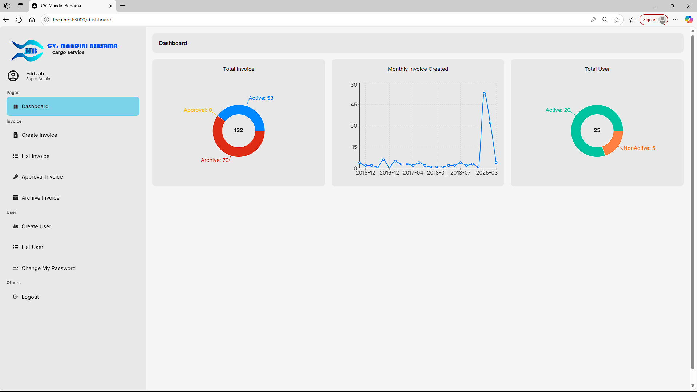
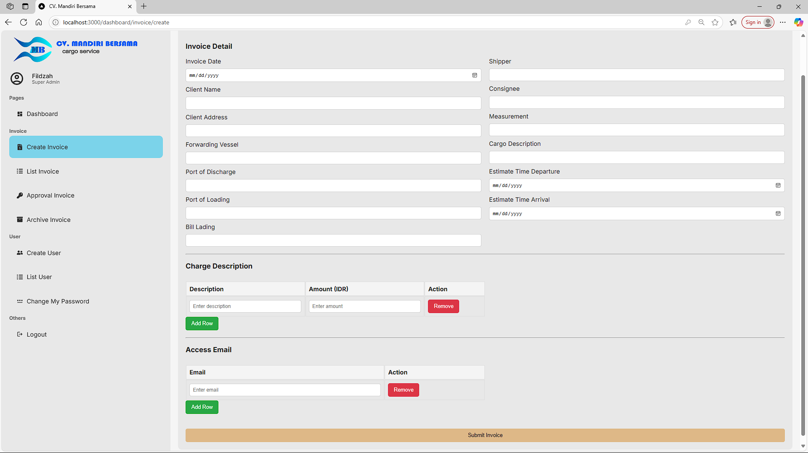
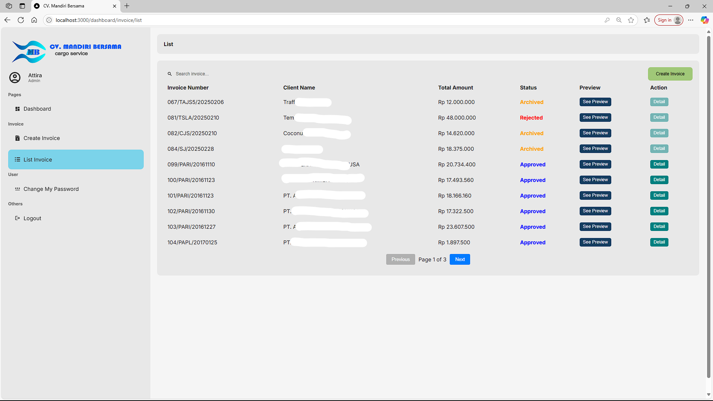
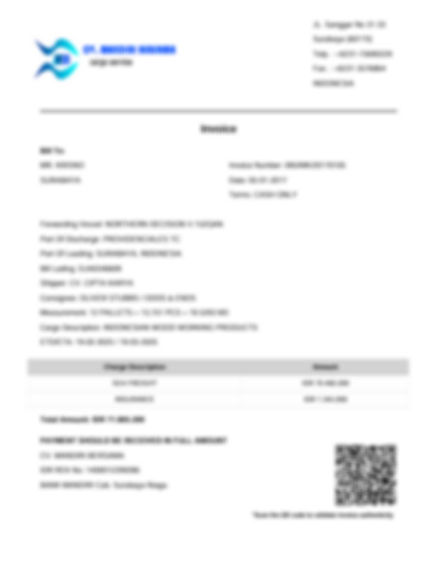
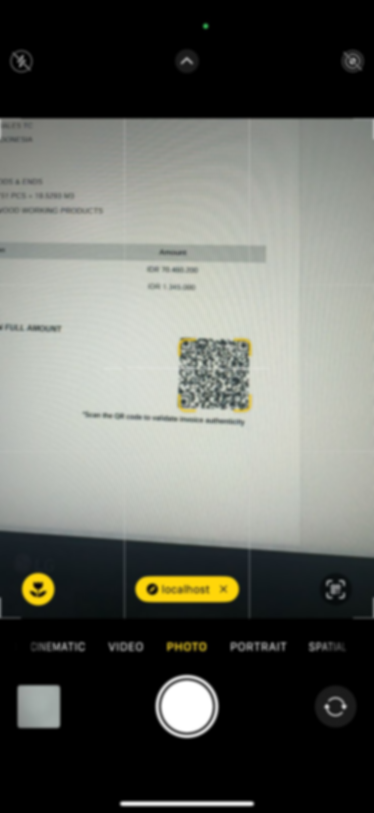
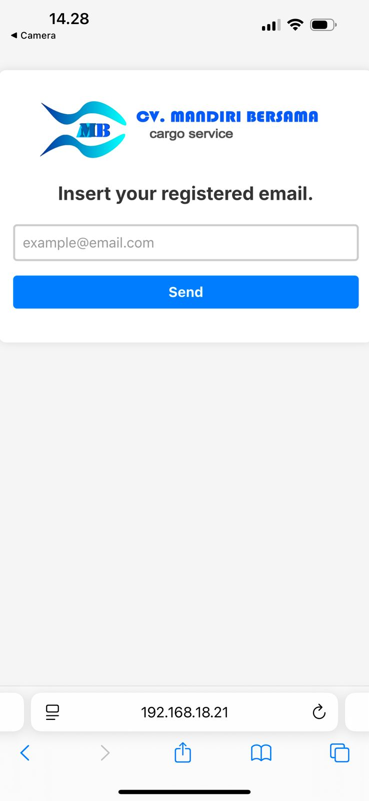
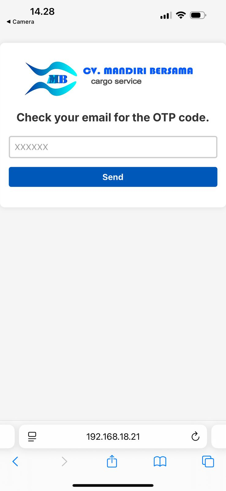
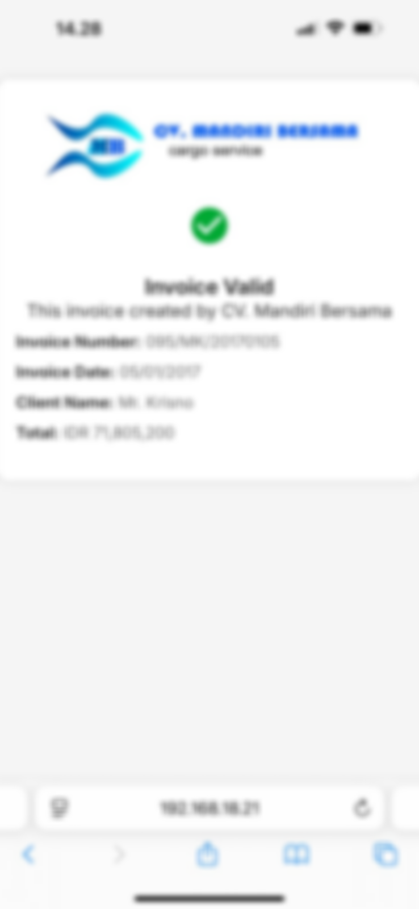

## About the app

This is a web-based application developed for CV. Mandiri Bersama, a forwarding and export-import consulting company. The system aims to validate the authenticity of invoice documents by replacing traditional signatures or stamps with a unique QR code for each invoice.

When scanned, the QR code redirects the user to a secure page displaying the invoice details. To ensure restricted access, the system implements Time-based One-Time Password (TOTP) and email verification. Only authorized users whose email addresses are registered in the system can receive a one-time OTP to view the invoice data.

## Tech Stack

- Frontend : Next.js
- Backend : Next.js API Routes
- Database : MySQL

## Super Admin & Admin Pages

  
  
  
  

## Invoice Validation Process

  
  
  
  

